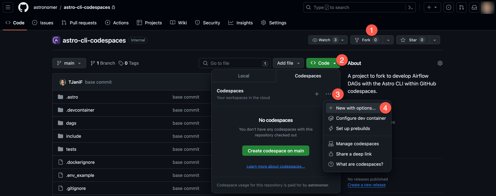
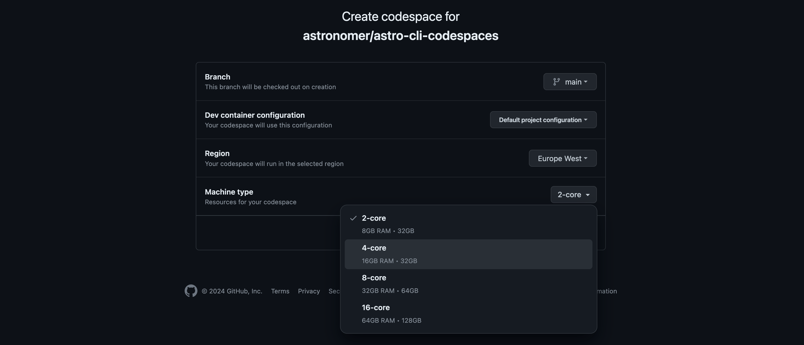
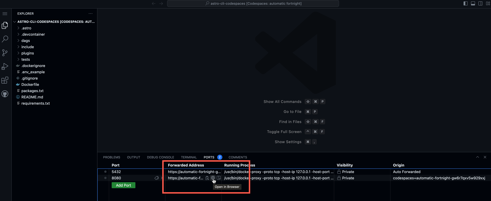
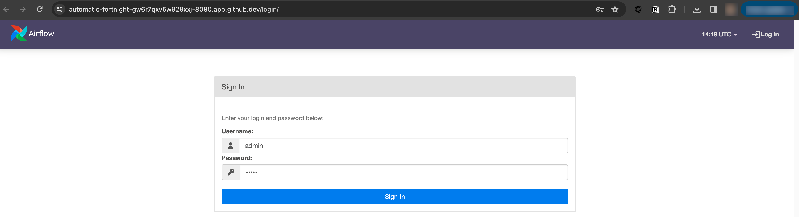

# How to Orchestrate Databricks (DBX) Jobs Using Airflow - webinar demo

This repository contains the code for the webinar demo shown in: How to Orchestrate Databricks Jobs Using Airflow.

[Watch the webinar here for free!](https://www.astronomer.io/events/webinars/%20orchestrate-databricks-jobs-using-airflow-video/)

## Content

This repository contains:

- `load_to_delta_lake`: A DAG that uses the DatabricksSqlOperator and DatabricksCopyIntoOperator to load data from S3 into a DBX SQL warehouse.
- `run_notebooks_simple_example`: A DAG that runs a set of notebooks (examples available in `/databricks_notebooks` in DBX) using the DatabricksWorkflowTaskGroup and DatabricksNotebookOperators.
- `run_notebooks_complex`: A DAG running the same set of notebooks in a more complex DAG structure and injecting notebook params.
- `setup_sample_data`: A helper DAG to copy data from the include folder into S3.
- `tutorial_dag`: A simple DAG from the [Orchestrate Databricks jobs with Airflow](https://www.astronomer.io/docs/learn/airflow-databricks) tutorial using the  DatabricksWorkflowTaskGroup and DatabricksNotebookOperators.

## How to run the demo

### Run the demo locally

1. Clone this branch of the repository.
2. Make sure you have the [Astro CLI](https://docs.astronomer.io/astro/cli/install-cli) installed and that [Docker](https://www.docker.com/products/docker-desktop) is running.
3. Copy the .env.example file to a new file called `.env` and fill in your own values and credentials into the `<>` placeholders. Note that you do not need a working Snowflake connection since the operator is mocked in the `run_notebooks_complex` DAG.
You will need a DBX and AWS account.
4. Run `astro dev start` to start the Airflow instance. The webserver with the Airflow UI will be available at `localhost:8080`. Log in with the credentials `admin:admin`.
5. Copy the DBX notebooks from [`/databricks_notebooks`](/databricks_notebooks/) into your DBX environment.
6. Run the `setup_sample_data` DAG to copy the example data from the include folder to S3. 
7. Run the `load_to_delta_lake` DAG (`Load data S3 to Delta Lake 🐟`) to copy the data into DBX. 
8. Run either of the run_notebooks DAGs to run your notebooks.

### Run the demo in GitHub Codespaces

You can run this Airflow project without installing anything locally by using GitHub Codespaces.

1. Fork this repository.
2. Create a new GitHub codespaces project on your fork by clicking **...** and **New with options**. Make sure it uses at least 4 cores!

    

    

3. Wait for the codespaces project to start. Once it has started, open a new terminal and run the following command:

    ```bash
    astro dev start
    ```

4. Once the Airflow project has started access the Airflow UI by clicking on the **Ports** tab and opening the forward URL for port 8080.

    

5. Log in to the Airflow UI using the credentials `admin` and `admin`.

    


> Note that you might need to reopen the forward URL from the **Ports** tab after logging in.

6. Copy the `.env.example` file to a new file called `.env` and fill in your own values and credentials into the `<>` placeholders. Note that you do not need a working Snowflake connection since the operator is mocked in the `run_notebooks_complex` DAG.
You will need a DBX and AWS account.
7. Run `astro dev start` to start the Airflow instance. The webserver with the Airflow UI will be available at `localhost:8080`. Log in with the credentials `admin:admin`.
8. Copy the DBX notebooks from [`/databricks_notebooks`](/databricks_notebooks/) into your DBX environment.
9. Run the `setup_sample_data` DAG to copy the example data from the include folder to S3. 
10. Run the `load_to_delta_lake` DAG (`Load data S3 to Delta Lake 🐟`) to copy the data into DBX. 
11. Run either of the `run_notebooks_x` DAGs to run your notebooks.

## Resources

- [Orchestrate Databricks jobs with Airflow tutorial](https://www.astronomer.io/docs/learn/airflow-databricks)
- [Airflow DBX provider docs](https://airflow.apache.org/docs/apache-airflow-providers-databricks/stable/index.html)
- [Databricks Docs](https://docs.databricks.com/en/index.html)